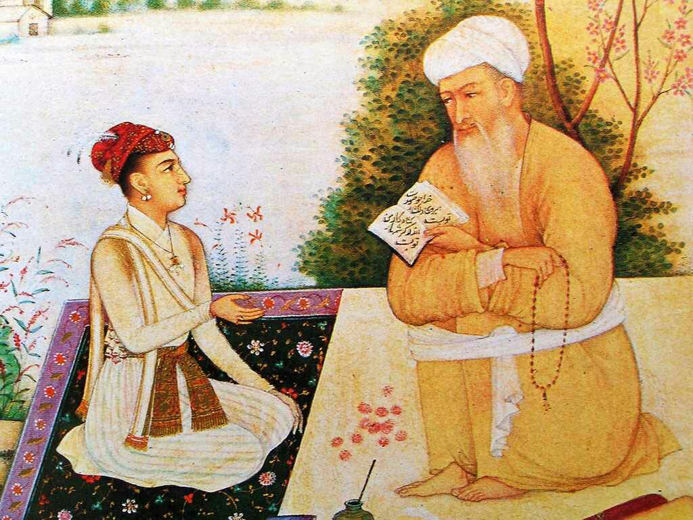

# Bercerita soal hidup 

`TARBIAH SEORANG GURU SUFI`

#### Seorang murid berbincang dengan seorang Guru Sufi:

“Guru, saya tidak mahu ikut pengajian ini lagi”.

“Apa alasannya?”, tanya Sang Guru Sufi.

“Saya lihat di pengajian ini perempuannya suka bergossip, laki-lakinya munafik, pengurusnya cara hidupnya tidak benar, jamaahnya sibuk dengan dunianya, dan sebagainya”.



“Baiklah. Tapi sebelum kau pergi, tolong lakukan sesuatu untukku. Ambil segelas penuh air dan berjalanlah mengelilingi luar serta dalam masjid ini tanpa menumpahkan setitis air sekalipun ke lantai. Setelah itu engkau boleh meninggalkan masjid ini seperti keinginanmu.”

“Itu mudah sekali!”

Dia pun segera melakukan apa yang diminta Sang Guru Sufi, sementara pengajian sedang berlangsung.

Setelah selesai, dia berkata kepada Sang Guru Sufi bahawa dia siap untuk pergi.

“Sebelum kau pergi, ada satu pertanyaan. Ketika kau tadi berjalan keliling luar serta dalam masjid, apa engkau mendengar orang bergosip, melihat orang munafik, melihat orang sibuk dengan dunianya?”

“Tidak.”

“Engkau tahu mengapa?”

“Tidak.”

“Kerana engkau fokus pada gelasmu, memastikan tidak tersandung dan tidak ada air yang tumpah.”

Begitulah dengan kehidupan kita.

```markdown
Ketika kita mengarahkan pandangan kita kepada Nur Allah yang kita imani, maka:

1. Kita tidak akan punya waktu untuk melihat kesalahan orang lain

2. Kita tidak akan punya waktu untuk menilai dan mengkritik orang lain.

3. Kita tidak akan punya waktu untuk bergosip ria dengan orang lain

4. Kita akan menolong orang lain dan fokus pada langkah kita menggapai Nur-Nya
```

#### Direndahkan tidak mungkin jadi sampah, disanjung tidak mungkin jadi rembulan. Maka jangan risaukan cakap-cakap orang, sebab setiap orang membacamu dengan pemahaman dan pengalaman yang berbeza.

Teruslah melangkah selama engkau di jalan yang benar, meski terkadang kebaikan tidak selalu dihargai.

Tidak usah sibuk menjelaskan tentang dirimu, sebab yang menyukaimu tidak perlu itu dan yang membencimu tidak percaya itu.

Hidup bukan tentang siapa yang terbaik, tapi tentang siapa yang mahu berbuat baik.

Jika dizalimi orang jangan berpikir untuk membalas dendam, tapi berpikirlah cara membalas dengan kebaikan.

Jangan mengeluh, teruslah berdoa dan ikhtiar. Sibukkan diri dalam kebaikan hingga keburukan lelah mengikutimu.

Semoga menjadi lebih baik dan lebih bermanfaat.

### Contact

for web development [contact ashrul](https://github.com/ashrulpuo) +(60) 18-4620843
